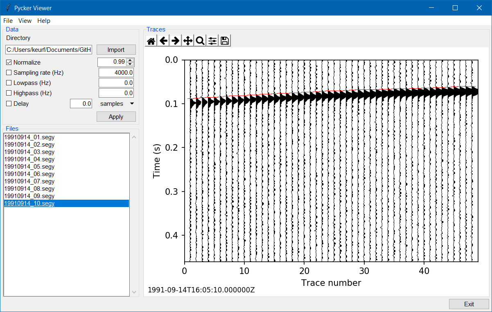

******
Pycker
******

Pycker provides user-friendly routines to visualize seismic traces and pick
first break arrival times. This package requires ObsPy.

:Version: 1.1.0
:Author: Keurfon Luu
:Web site: https://github.com/keurfonluu/pycker
:Copyright: This document has been placed in the public domain.
:License: Pycker is released under the MIT License.

**NOTE**: Pycker has been implemented in the frame of my Ph. D. thesis. If
you find any error or bug, or if you have any suggestion, please don't hesitate
to contact me.

Installation
============

The recommended way to install Pycker is through pip (internet required):

.. code-block:: bash

    pip install pycker
    
Otherwise, download and extract the package, then run:

.. code-block:: bash

    python setup.py install
    

Usage
=====

.. code-block:: python

  from pycker.gui import main
  
  main()

- left click: pick first break
- middle click: remove pick
- right click: print pick (receiver number, pick index, pick time)